

  

# PetPals

PetPals is a mobile social application developed as a team engineering project at Wrocław University of Science and Technology. The project addresses a socially motivated problem: the difficulty of building local relationships and finding walking companions among dog owners, especially in larger cities. The application was designed as a dedicated digital space where dog owners can connect with each other, create profiles for their pets, organize walks, communicate and build local communities around everyday dog-related activities.

## Project goal

The main goal of the project was to design and implement a functional full-stack prototype of a community-oriented mobile application for dog owners. The system combines typical social networking features with domain-specific functionality related to dog profiles, walks, location-based interaction and local community building.

The project was intended not only as a technical implementation, but also as a response to a real user problem. It explores how mobile technologies can support social interaction, reduce isolation among dog owners and make everyday activities, such as walking a dog, more social and better organized.

## Main features

The application includes a set of features supporting both general social interaction and dog-owner-specific use cases:

- user registration, login and account management,
- user profiles with descriptions and profile pictures,
- dog profiles connected with user accounts,
- friendship management between users,
- posts and post comments,
- chat and real-time communication features,
- group walk creation, editing, joining and leaving,
- comments related to group walks,
- filtering and browsing walks by selected tags,
- location-based features supporting walk organization,
- image upload and storage support.

## Screen Mockups
### Getting Started

<table>
  <tr>
    <td align="center">
      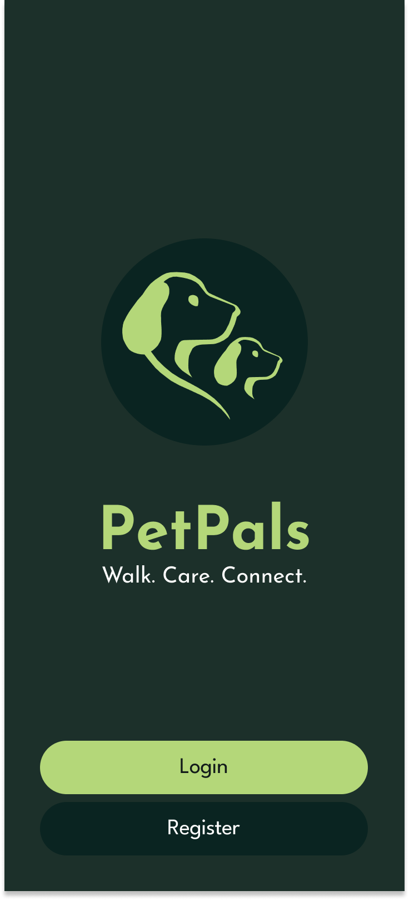 
      <b>Welcome Screen</b>
    </td>
    <td align="center">
      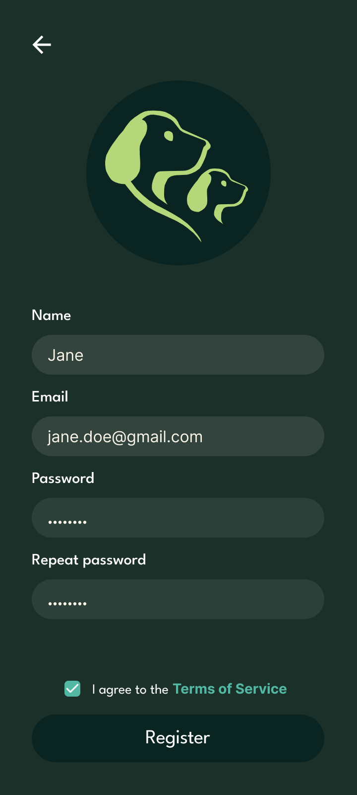 
      <b>User Registration</b>
    </td>
    <td align="center">
       
      <b>Edit Profile</b>
    </td>
  </tr>
</table>

### Profiles & Social Features

<table>
  <tr>
    <td align="center">
      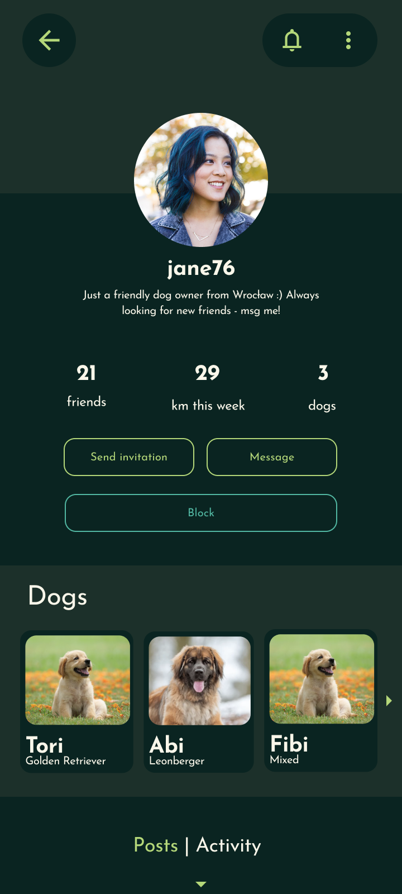 
      <b>User Profile</b>
    </td>
    <td align="center">
      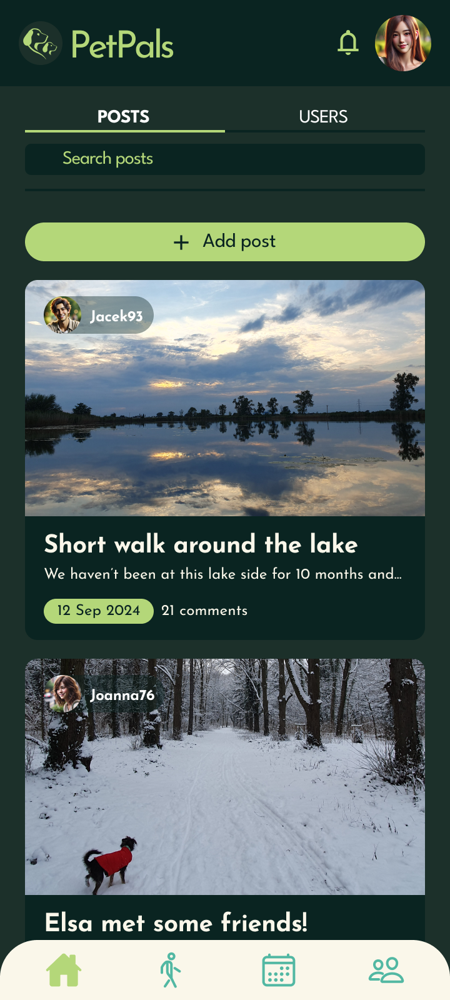 
      <b>User Posts</b>
    </td>
    <td align="center">
      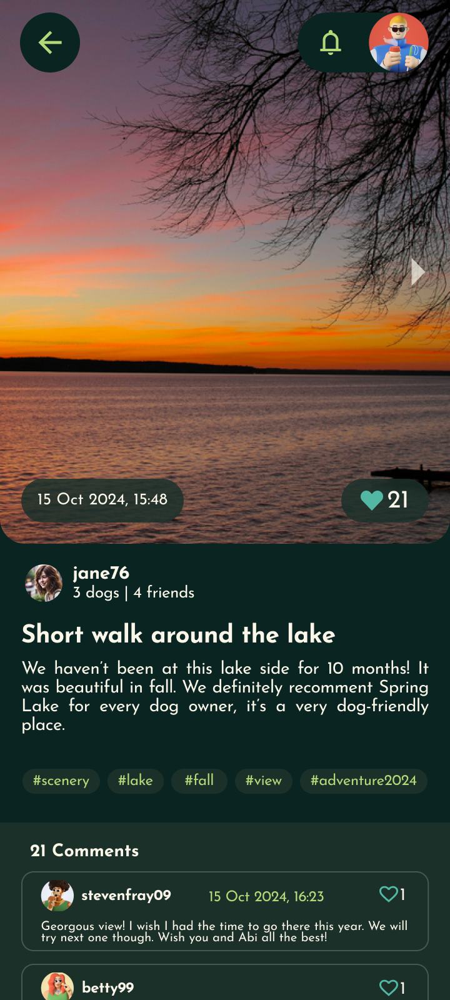 
      <b>Post Details</b>
    </td>
  </tr>
  <tr>
    <td align="center">
      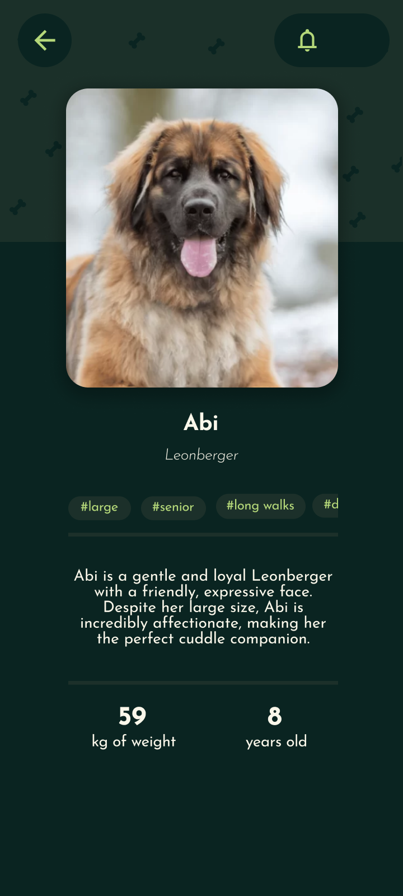 
      <b>Pet Profile</b>
    </td>
    <td align="center">
      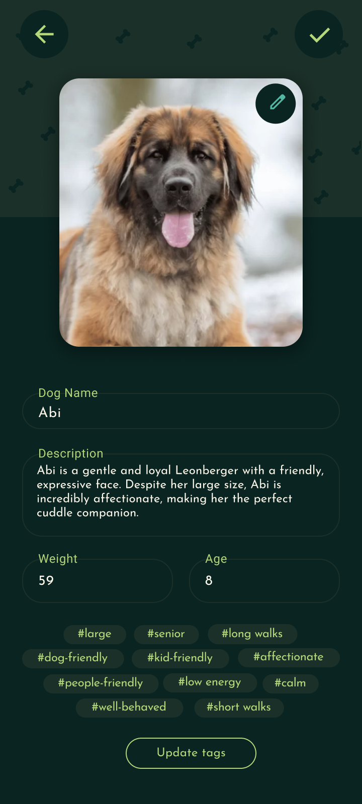 
      <b>Edit Pet Profile</b>
    </td>
    <td></td>
  </tr>
</table>

### Messaging

<table>
  <tr>
    <td align="center">
      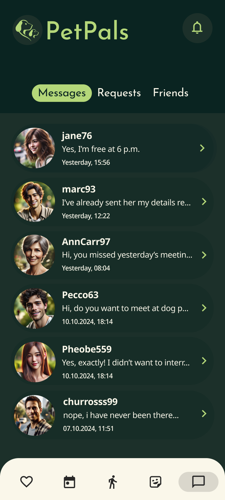 
      <b>Chats</b>
    </td>
    <td align="center">
      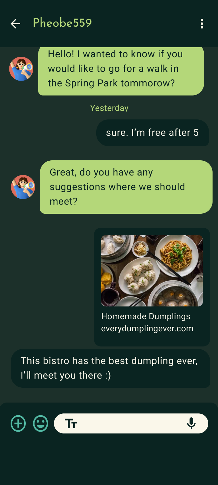 
      <b>Conversation</b>
    </td>
  </tr>
</table>

### Group Walks

<table>
  <tr>
    <td align="center">
      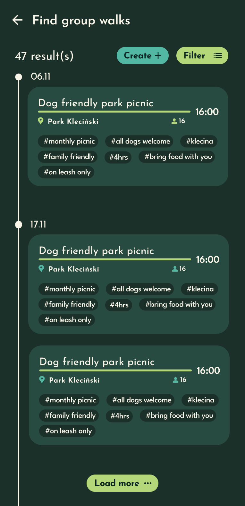 
      <b>Find a Group Walk</b>
    </td>
    <td align="center">
      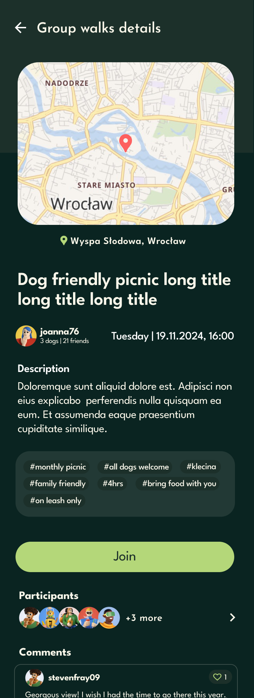 
      <b>Group Walk Details</b>
    </td>
    <td align="center">
      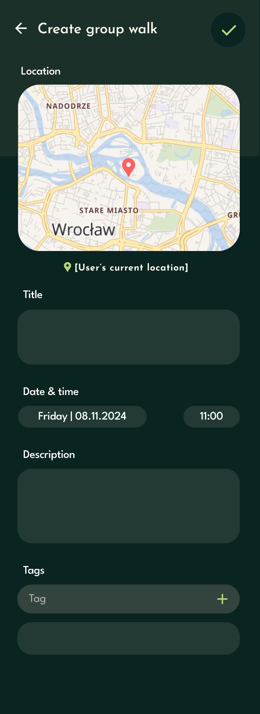 
      <b>Create a Group Walk</b>
    </td>
  </tr>
  <tr>
    <td align="center">
      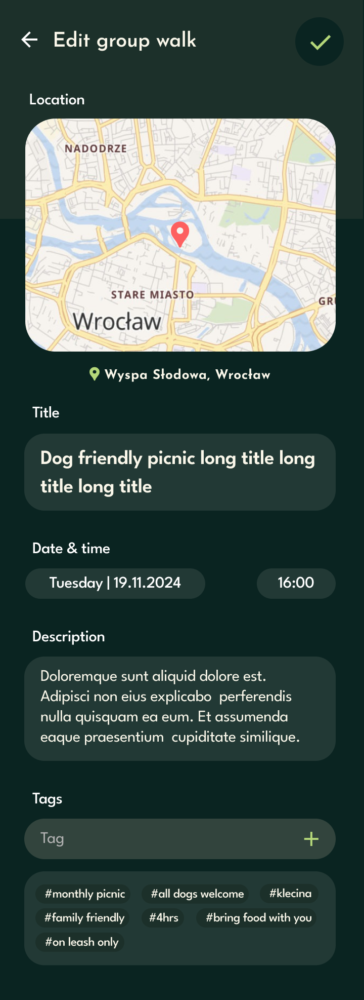 
      <b>Edit Group Walk</b>
    </td>
    <td align="center">
      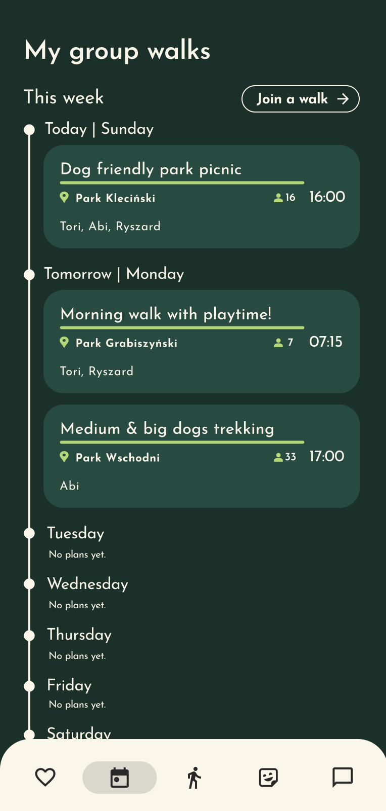 
      <b>Scheduled Walks</b>
    </td>
    <td></td>
  </tr>
</table>

### Walking & Activity Tracking

<table>
  <tr>
    <td align="center">
      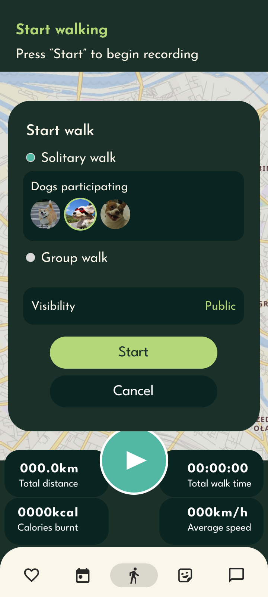 
      <b>Walk Now</b>
    </td>
    <td align="center">
      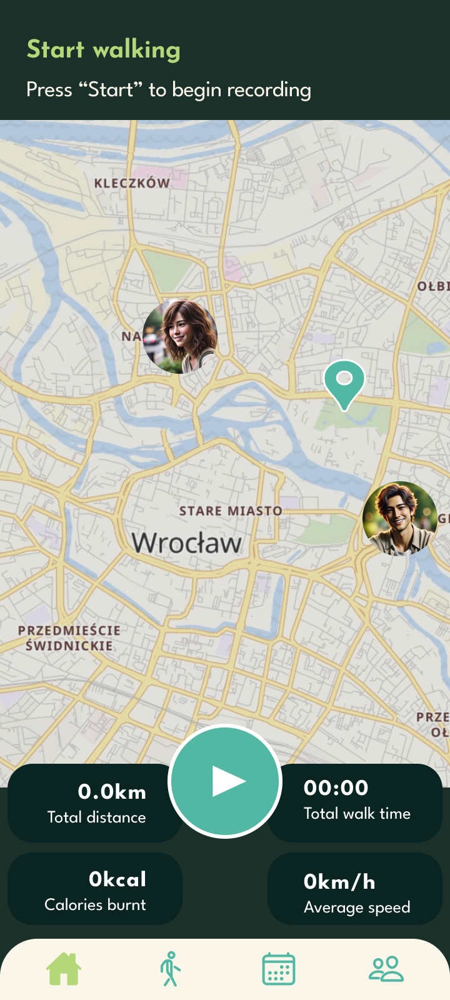 
      <b>Start Walk</b>
    </td>
    <td align="center">
      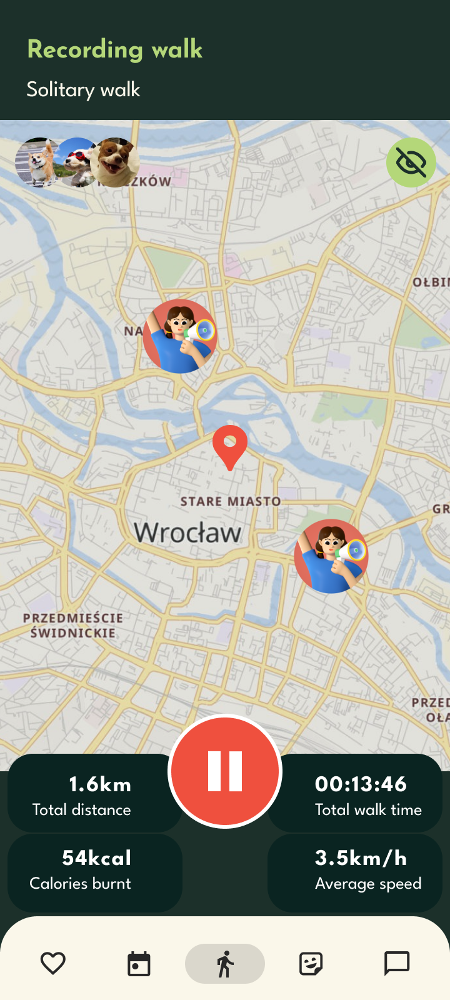 
      <b>Walk in Progress</b>
    </td>
  </tr>
  <tr>
    <td align="center">
      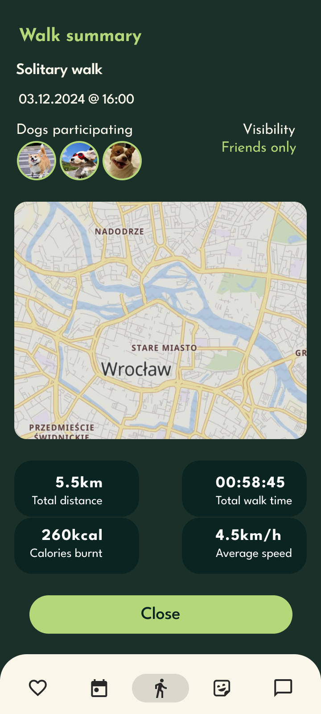 
      <b>Walk Summary</b>
    </td>
    <td align="center">
      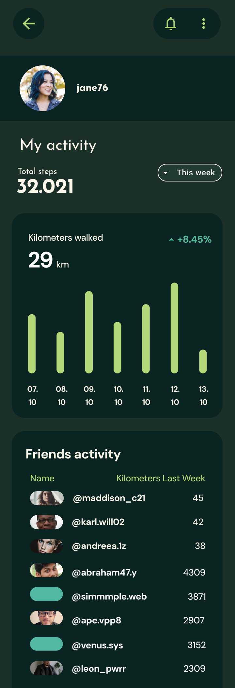 
      <b>My Activity</b>
    </td>
    <td></td>
  </tr>
</table>

## Architecture

PetPals was implemented as a full-stack application consisting of two main parts:

### Backend

The backend is a Spring Boot application written in Java. It exposes REST API endpoints responsible for authentication, user management, dog profiles, friendships, posts, comments, chats, group walks, locations and image handling. The backend uses a layered structure based on controllers, services, entities and request/response payloads.

The backend stack includes:

- Java and Spring Boot,
- Spring Web for REST API implementation,
- Spring Security and JWT-based authentication,
- Spring Data JPA,
- PostgreSQL database support,
- OpenAPI / Swagger documentation,
- AWS S3 integration for image storage,
- WebSocket / MQTT-related dependencies for communication features,
- Redis and caching-related dependencies.

### Frontend

The frontend is a mobile application built with React Native and Expo. It provides user-facing screens for authentication, home view, chat, user profiles and walk-related functionality. The frontend communicates with the backend API and uses mobile-oriented libraries for navigation, maps, location handling, image selection and asynchronous data storage.

The frontend stack includes:

- React Native,
- Expo,
- TypeScript,
- Expo Router,
- React Navigation,
- React Native Maps,
- Expo Location,
- Axios,
- React Query,
- Async Storage,
- UI libraries for mobile interface development.

# Credits

Project authors and main contributors:
- Aleksandra Broda
- Dominika Kołowrotkiewicz
- Dominika Sachanbińska